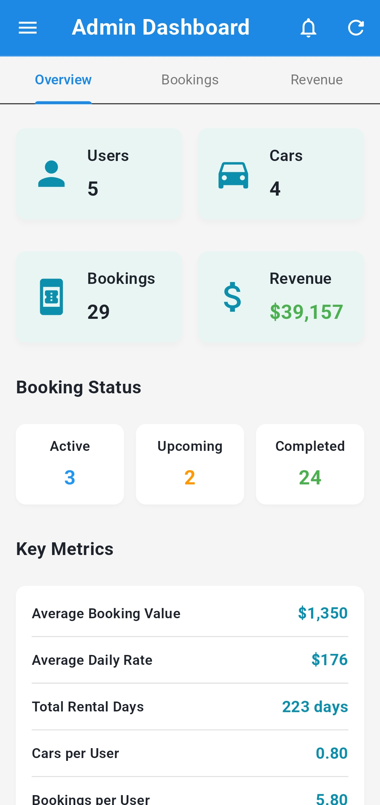

# CarRental - Modern Flutter Car Rental Application

## Project Overview

CarRental is a comprehensive mobile application built with Flutter that provides a seamless car rental experience for users and a powerful management system for administrators. The app features a clean, modern UI following Material Design principles and implements a robust architecture for scalability and maintainability.

## Technology Stack

- **Frontend**: Flutter with Material Design components
- **State Management**: Efficient state management approach
- **Database**: Firebase integration for data management
- **Authentication**: User authentication with role-based access control
- **Analytics**: Custom analytics dashboard with charts for data visualization using FL Chart
- **Architecture**: Clean architecture principles with organized code structure

## Key Features

### User Features

- **User Authentication**: Secure login/signup system
- **Car Browsing**: Browse available cars with detailed information
- **Booking Management**: Create, view, and manage bookings
- **User Profile**: Manage personal information and view booking history

### Admin Panel Features

- **Dashboard Analytics**: Comprehensive analytics dashboard with visual representations
  - Revenue tracking with breakdowns by car type
  - Booking status monitoring (Active, Upcoming, Completed)
  - User and car statistics
- **Car Management**: Add, edit, and manage car listings
- **User Management**: View and manage user accounts
- **Booking Oversight**: Monitor all bookings
- **Revenue Reporting**: Tools for financial analysis

## Implementation Details

### UI/UX Design

- **Modern Interface**: Clean, intuitive interface with Material Design components
- **Responsive Design**: Adapts to different screen sizes and orientations
- **Consistent Theming**: Unified color scheme and typography throughout the app
- **Data Visualization**: Interactive charts and graphs for analytics

### Key Components

- **Admin Home Screen**: Main dashboard for administrators with quick access to key metrics and functions
- **Analytics Screen**: Detailed visualizations of booking data, revenue, and other important statistics
- **Car Management**: Interface for adding and managing cars in the system
- **User Management**: Tools for handling user accounts and permissions
- **Booking Management**: System for tracking and managing all active and past bookings

## Screenshots

Here are some screenshots showcasing the key features of the CarRental app:

### User Interface
<table>
  <tr>
    <td></td>
    <td></td>
    <td></td>
  </tr>
  <tr>
    <td align="center"><b>Home Screen</b></td>
    <td align="center"><b>Car Details</b></td>
    <td align="center"><b>Booking Process</b></td>
  </tr>
</table>

### User Authentication & Profile
<table>
  <tr>
    <td></td>
    <td></td>
    <td></td>
  </tr>
  <tr>
    <td align="center"><b>Login Screen</b></td>
    <td align="center"><b>Registration</b></td>
    <td align="center"><b>User Profile</b></td>
  </tr>
</table>

### Admin Features
<table>
  <tr>
    <td></td>
    <td></td>
    <td></td>
  </tr>
  <tr>
    <td align="center"><b>Admin Dashboard</b></td>
    <td align="center"><b>User Managment</b></td>
    <td align="center"><b>Cars Management</b></td>
  </tr>
</table>

## Getting Started

### Prerequisites

- Flutter SDK
- Dart SDK
- Firebase Project (for backend services)
- Android Studio / VS Code with Flutter plugins

### Installation

1. Clone the repository
   ```bash
   git clone https://github.com/Eshwar-M17/car_rental_app
   ```

2. Navigate to the project directory
   ```bash
   cd carrentalapp
   ```

3. Install dependencies
   ```bash
   flutter pub get
   ```

4. Configure Firebase :
   - Create a new Firebase project
   - Add Android/iOS apps to your Firebase project
   - Download and add the configuration files to your project
   - Enable Authentication and database services in your Firebase console


5. Run the application
   ```bash
   flutter run
   ```

## Features Implemented

Based on the code examined, the following features have been implemented:

- **Admin Dashboard**: A comprehensive overview panel with metrics and navigation
- **Analytics Module**: Data visualization for bookings, revenue, and user statistics
- **UI Theming**: Consistent color schemes and design elements
- **Responsive Layouts**: Adaptable interfaces for various screen sizes
- **Interactive Charts**: Visual representation of business data using pie charts and other visualizations

## Future Enhancements

- **Enhanced User Experience**: Further refinements to UI/UX
- **Additional Analytics**: More detailed data visualizations and metrics
- **Advanced Filtering**: Enhanced search and filtering options
- **Expanded Admin Controls**: Additional management tools for administrators
- **User-facing Features**: Expanded functionality for end users
- **Notification System**: Real-time alerts for important events

## Contributing

Contributions are welcome! Please feel free to submit a Pull Request.

